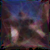
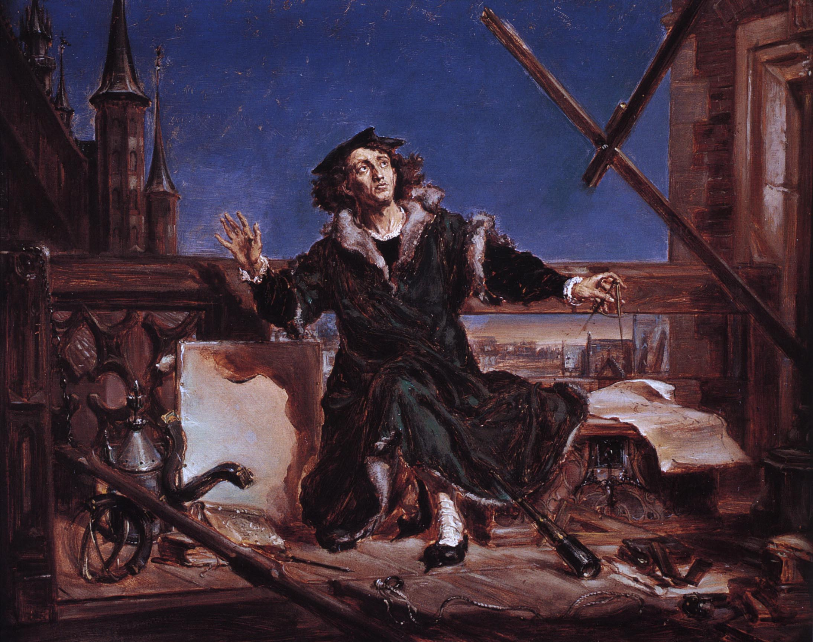
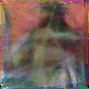
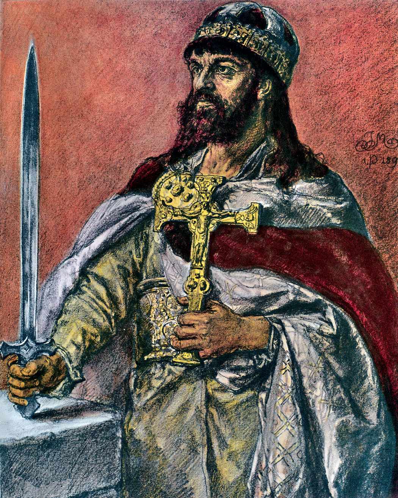

# Image_generating

Generating a similar image using genetic algorithm.
The main idea is to generate random triangles and check how similar they are to the original image. Then randomly do change in triangles and compare with a previous version.

Some results are here:

### Kopernik Jan Matejko:

Generated:

Original:

### Mieszko I of Poland Jan Matejko

Generated:

Original:

